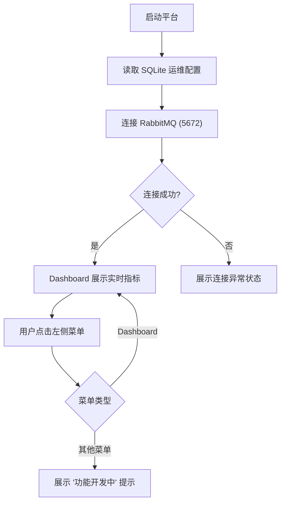

## 1. 产品概述

RabbitMQ 运维管理平台是面向运维工程师的专业消息中间件监控与管理工具，提供可视化 Dashboard、队列管理、交换机管理及消息中心等核心功能。

- 解决 RabbitMQ 集群运维可视化不足的问题，提升运维效率
- 面向运维工程师、中间件管理员、系统架构师
- 提供一站式 RabbitMQ 监控、配置与消息管理能力

## 2. 核心功能

### 2.1 用户角色
| 角色 | 注册方式 | 核心权限 |
|------|---------|---------|
| 管理员 | 系统内置 | 所有功能的查看与操作权限 |

### 2.2 功能模块
1. **Dashboard**: 连接状态概览、Channel 数量、队列总数、消息入/出速率
2. **队列管理**: 队列列表、队列详情、队列创建与删除、消息查看
3. **交换机管理**: 交换机列表、交换机详情、交换机创建与删除、绑定管理
4. **消息中心**: 消息发送、消息追踪、死信队列查看

### 2.3 页面详情
| 页面名称 | 模块名称 | 功能描述 |
|---------|---------|---------|
| Dashboard | 概览卡片 | 展示 RabbitMQ 连接状态、Channel 数、队列总数、消息速率 |
| Dashboard | 实时监控 | 动态刷新监控指标，展示当前运行状态 |
| 队列管理 | 占位页 | 功能开发中提示 |
| 交换机管理 | 占位页 | 功能开发中提示 |
| 消息中心 | 占位页 | 功能开发中提示 |

## 3. 核心流程

用户登录系统后进入 Dashboard 页面，系统自动连接配置的 RabbitMQ 实例并实时采集监控数据。用户可通过左侧导航切换至其他功能模块。

## 4. 用户界面设计

### 4.1 设计风格
- **主色调**: 深海蓝 (#0F172A) 背景，科技蓝 (#3B82F6) 主色，青绿 (#10B981) 成功色，橙红 (#F59E0B) 警告色，珊瑚红 (#EF4444) 错误色
- **按钮风格**: 圆角胶囊按钮，带渐变边框，hover 微上浮发光效果
- **字体**: JetBrains Mono 等宽字体用于数据展示，Inter 用于界面文本
- **布局风格**: 左侧固定导航 + 顶部状态栏 + 主内容区，卡片式布局，深色背景配合霓虹渐变边框
- **图标风格**: 线性简约图标，配状态色发光效果

### 4.2 页面设计概述
| 页面名称 | 模块名称 | UI 元素 |
|---------|---------|---------|
| Dashboard | 概览卡片 | 深色玻璃拟态卡片，渐变发光边框，实时数值动画，状态指示灯 |
| Dashboard | 主容器 | 深色背景，网格线纹理，顶部状态栏展示连接信息 |
| 通用布局 | 左侧导航 | 深色侧边栏，菜单项 hover 高亮，选中项带左侧渐变指示条 |
| 占位页面 | 提示区 | 居中大号图标 + "功能开发中" 文字，科技感动效 |

### 4.3 响应式
- 桌面端优先设计，侧边栏固定宽度 240px
- 主内容区自适应，最小宽度 1024px
- 概览卡片响应式排列：大屏 4 列，中屏 2 列，小屏 1 列
