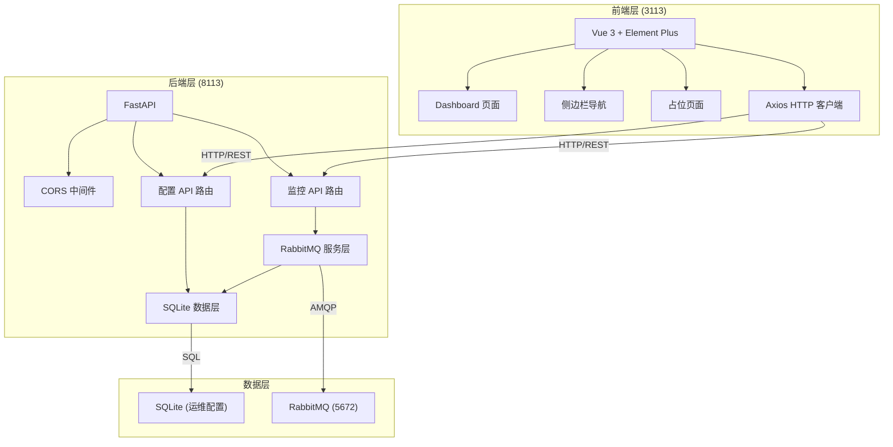
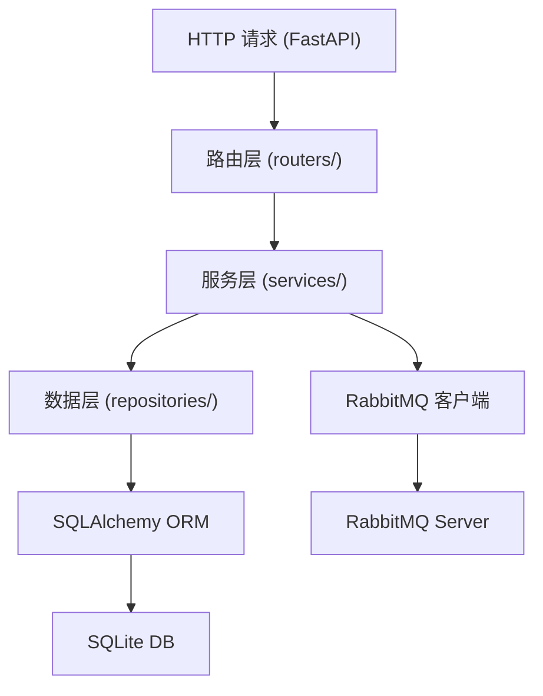
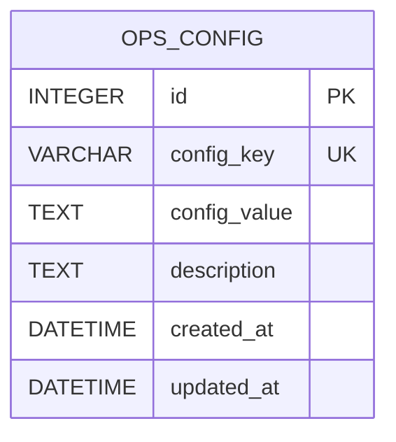

## 1. 架构设计



## 2. 技术说明

- **前端**: Vue 3 + TypeScript + Vite + Element Plus + Vue Router + Pinia + Axios
- **前端初始化工具**: Vite (vue-ts 模板)
- **后端**: Python 3.10+ + FastAPI + Uvicorn
- **数据库**: SQLite (通过 SQLAlchemy ORM 访问)
- **RabbitMQ 客户端**: pika + aio-pika
- **API 文档**: FastAPI 自动生成 Swagger UI (/docs)

## 3. 路由定义

### 前端路由
| 路由 | 用途 |
|------|------|
| /dashboard | Dashboard 概览页 |
| /queues | 队列管理 (占位) |
| /exchanges | 交换机管理 (占位) |
| /messages | 消息中心 (占位) |

### 后端 API 路由
| 方法 | 路由 | 用途 |
|------|------|------|
| GET | /api/health | 后端健康检查 |
| GET | /api/rabbitmq/overview | 获取 RabbitMQ 概览数据 (连接状态、Channel、队列数、消息速率) |
| GET | /api/rabbitmq/connection/status | 获取 RabbitMQ 连接状态 |
| GET | /api/config | 获取运维配置列表 |
| POST | /api/config | 新增运维配置 |
| PUT | /api/config/{id} | 更新运维配置 |
| DELETE | /api/config/{id} | 删除运维配置 |

## 4. API 定义

```typescript
// RabbitMQ 概览响应
interface RabbitMQOverview {
  connection: {
    status: 'connected' | 'disconnected' | 'connecting';
    host: string;
    port: number;
    uptime?: number;
  };
  channels: number;
  queues: number;
  messageRate: {
    publish: number;
    deliver: number;
    ack: number;
  };
  timestamp: number;
}

// 连接状态响应
interface ConnectionStatus {
  status: 'connected' | 'disconnected' | 'connecting';
  host: string;
  port: number;
  error?: string;
}

// 运维配置
interface OpsConfig {
  id: number;
  key: string;
  value: string;
  description?: string;
  createdAt: string;
  updatedAt: string;
}
```

## 5. 后端架构图



后端目录结构:
```
backend/
├── main.py                 # FastAPI 应用入口
├── requirements.txt        # Python 依赖
├── database.py             # SQLAlchemy 数据库连接
├── models.py               # 数据模型定义
├── schemas.py              # Pydantic 请求/响应模型
├── routers/
│   ├── monitor.py          # 监控相关 API
│   └── config.py           # 配置管理 API
├── services/
│   ├── rabbitmq_service.py # RabbitMQ 连接与采集
│   └── config_service.py   # 配置业务逻辑
└── rabbitmq.db             # SQLite 数据库文件 (自动生成)
```

## 6. 数据模型

### 6.1 数据模型定义



### 6.2 数据定义语言

```sql
-- 运维配置表
CREATE TABLE IF NOT EXISTS ops_config (
    id INTEGER PRIMARY KEY AUTOINCREMENT,
    config_key VARCHAR(100) NOT NULL UNIQUE,
    config_value TEXT NOT NULL,
    description TEXT,
    created_at DATETIME DEFAULT CURRENT_TIMESTAMP,
    updated_at DATETIME DEFAULT CURRENT_TIMESTAMP
);

-- 初始化 RabbitMQ 默认配置
INSERT INTO ops_config (config_key, config_value, description) VALUES
    ('rabbitmq_host', 'localhost', 'RabbitMQ 主机地址'),
    ('rabbitmq_port', '5672', 'RabbitMQ AMQP 端口'),
    ('rabbitmq_username', 'admin', 'RabbitMQ 用户名'),
    ('rabbitmq_password', 'admin123', 'RabbitMQ 密码'),
    ('rabbitmq_vhost', '/', 'RabbitMQ 虚拟主机')
ON CONFLICT(config_key) DO NOTHING;

CREATE INDEX IF NOT EXISTS idx_ops_config_key ON ops_config(config_key);
```
